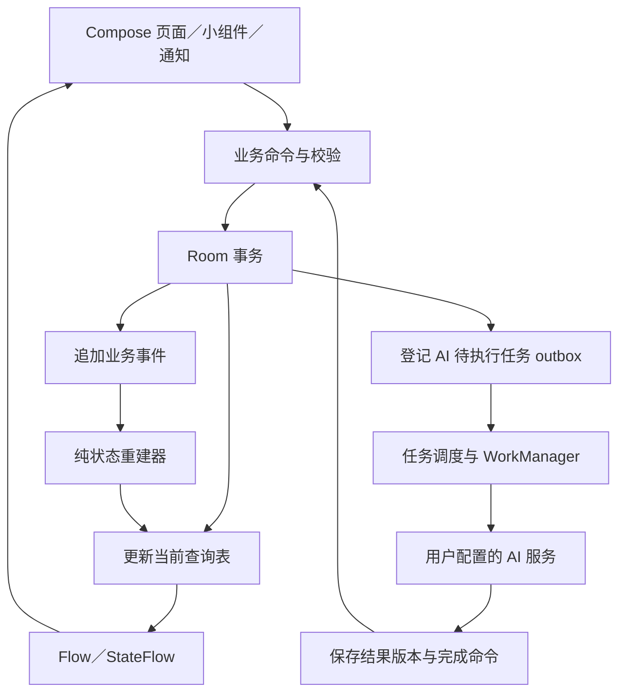

# 核心业务事件溯源方案

日期：2026-10-09。状态：用户已确认第一版对录音、AI 处理和记忆变更采用 Event Sourcing；以下为建议的具体实现，待工程阶段验证。

## 范围与目的

用持久化业务事件记录“发生过什么”，由事件重建查询状态。用途是保存来源与修订历史、支持崩溃后的任务恢复、避免重试造成重复内容，并为记忆纠正和撤销提供依据。

| 范围 | 建议处理方式 |
| --- | --- |
| 录音生命周期与内容修订 | 事件溯源：开始请求、实际开始、暂停、继续、保存／中断、标题和转写修订 |
| AI 任务 | 事件溯源：请求、尝试、完成、失败、取消、结果过期与重新生成 |
| 记忆变更 | 事件溯源：候选提出、确认、修正、合并、失效、忘记及来源变化 |
| 列表、详情、任务面板、关键词搜索 | 从事件生成的 Room 查询表／索引，允许重建 |
| 音频、标题及标签文本、转写正文、摘要、记忆正文、问答正文 | 单独的不可变版本内容存储；事件引用内容 ID，支持按用户请求删除内容 |
| API Key | Keystore 保护的私有凭据存储；事件只引用不含密钥的配置版本 |
| 普通设置、当前页面选中态、滚动位置 | DataStore 或合适的 UI 状态机制；不要求完整业务事件历史 |
| 波形、音量、计时刷新、AI token 流 | 临时状态流；仅持久化有恢复意义的检查点或最终结果 |

这里的 Event Sourcing 不等同于把消息放进 SharedFlow，也不等同于 AI 接口的 SSE 流。SharedFlow／StateFlow 可以用于内存通知，SSE 可以用于接收模型输出，但可重建的业务历史来自数据库中的事件。

## 本地实现结构

第一版使用单个 Room／SQLite 数据库实现事件表、当前状态投影和 outbox。音频和大块内容独立保存。无需部署独立事件服务器；手机直接访问用户配置的 AI 服务。

对核心状态，事件追加、当前投影更新与 outbox 登记在同一 Room 事务内提交，以保证成功返回后读取到一致状态。搜索面向保存在本机的转写等文本，转写完成后即可查询当前文本投影；若后续为性能引入异步全文索引，需标明其进度或版本，并在索引尚未更新时通过当前文本投影查询，避免新转写暂时搜不到。Compose 读取投影，不在每次显示列表时重放全量事件。

## 命令、事件与聚合

命令表达请求，事件表达经过验证的事实。例如 `StartRecording` 是命令，`RecordingStarted` 只有在真实采集开始后才能产生；按钮被点击或服务被请求不等于已经开始录音。

| 聚合 | 代表事件 | 关键约束 |
| --- | --- | --- |
| Recording | RecordingStartRequested、RecordingStarted、RecordingPaused、RecordingResumed、RecordingSaved、RecordingInterrupted、TranscriptRevisionAdded、RecordingTitleChanged | 一个有效采集会话；成功保存与实际可用音频对应；人工修改版本可追溯 |
| AiJob | AiJobRequested、AiAttemptStarted、AiJobCompleted、AiAttemptFailed、AiJobCancelled、AiResultMarkedStale | 每次逻辑任务有稳定 ID；尝试次数与结果区分；失败不删除源记录 |
| Memory | MemoryProposed、MemoryConfirmed、MemoryCorrected、MemoryMerged、MemoryInvalidated、MemoryForgotten | 候选与事实区分；来源引用有效；被用户拒绝的候选不能自动反复出现 |

事件需体现业务意图，避免只有泛化的 `FieldUpdated`。领域处理建议采用可测试的纯函数 `decide(state, command) -> events` 与 `evolve(state, event) -> state`，外部服务、数据库、时钟和 ID 生成留在应用层边界。具体命名与聚合拆分在首次实现中收敛。

## 事件信封与排序

每条事件至少保存：

- `eventId`：全局唯一事件 ID。
- `aggregateType`、`aggregateId`、`aggregateVersion`：对象类型、对象身份及递增版本。
- `eventType`、`schemaVersion`、`payload`：有类型的事件与结构版本，payload 引用必要的内容版本。
- `occurredAt`、`recordedAt`：事实发生时间与本地入库时间；录音另存时区／偏移以解释“明天”等表达。
- `correlationId`、`causationId`：关联一条处理链和触发来源。
- `globalPosition`：本地数据库分配的递增位置，供投影检查点使用。

使用 `(aggregateId, aggregateVersion)` 唯一约束及 expectedVersion 检查，防止服务、页面和 Worker 并发写入同一旧状态；不只依赖进程内 Mutex。重试或重复命令使用稳定的幂等键。事件次序依赖版本／数据库位置，不依赖手机墙上时钟，也不直接按 UUID 的字面顺序排序。

备份合并时保留 eventId 和原聚合版本，重新分配本地 globalPosition。遇到同聚合版本的不同事件时明确报告冲突，不自动取最后写入者；第一版不宣称由此自动获得跨设备协作同步。

## AI 任务与副作用

**事件重放只重建数据，绝不执行网络请求、录音、通知或任务入队。** 业务写入和副作用由不同入口负责：正常命令事务按规则创建 outbox 记录，重放器只更新投影。

outbox 是持久化的待执行任务表。数据库提交成功后唤醒调度器；应用恢复时扫描遗留待执行任务，以弥补“事务提交后、WorkManager 入队前进程退出”的窗口。Room 与 WorkManager 不在同一事务中，不能把两次写入当作原子操作。

每次 AI 请求保存任务 ID、源音频／文本版本、服务配置版本、模型和提示词版本、用户发起的生成版本。AI 输出作为新的内容版本保存，完成事件引用这个已保存结果。重放读取已保存的结果，不尝试重新生成同样的模型输出。

自动重试复用同一逻辑任务 ID；用户主动“重新生成”创建新的生成版本。调度采用至少一次执行语义，通过唯一约束、任务租约／尝试身份、服务商支持的幂等键及完成状态校验避免重复结果。网络超时可能发生在服务商已经处理之后，因此不能承诺对外请求和计费严格只发生一次。

AI 结果回写时再次检查源文本版本、任务取消状态和记录是否已删除。源文本已修改则保存为旧版本结果并标为过期，或依策略丢弃；不覆盖人工修订。用户取消后收到的迟到结果不能自动纳入记忆。

恢复备份时默认恢复历史结果，但未完成任务显示为待恢复；不能因为导入或重建投影立即上传录音并产生费用。用持久化的本机执行许可控制恢复任务，保留历史业务事件；调度器扫描也必须检查该许可，不能只改查询投影上的显示状态。用户继续任务后，才按当前有效配置恢复执行。普通应用进程重启仍可恢复本机原本获准执行的任务，两种恢复场景分别处理。

## 录音服务与文件一致性

麦克风启动走用户交互触发的原生前台服务路径，满足当前 Android 的权限与启动限制；不能交给普通后台队列等待执行。录音服务独立于 Activity／Compose，持有采集资源并管理实际状态。事件记录关键生命周期，计时和音量通过实时状态流更新。

对于文件与数据库之间无法原子提交的问题，采用明确顺序与恢复规则：

1. 为一次录音分配稳定 ID 和临时文件／分段目录。
2. 真实采集开始后记录 RecordingStarted；启动失败产生失败结果并释放资源。
3. 停止时先完成音频写入、必要的同步与封装，再在同文件系统内完成文件重命名／发布。
4. 音频可用后提交 RecordingSaved 及音频引用；随后按设置创建转写任务。
5. 启动恢复扫描清单与文件状态：已发布但未登记的文件可以核对后补登记；未完成的片段按可恢复能力处理；引用缺失文件的记录显示受损状态。

不能把“rename 成功”单独视为任意断电场景下的完整耐久性保证，也不能假设未封装完成的单个 M4A 总能恢复。初期以真实故障测试选择可接受的分段／检查点策略，优先保护短录音的可用内容。

如果上次事件状态为 RecordingStarted，但当前没有仍在运行的采集服务，恢复时应核对文件并记录中断。**重放历史不能使手机重新打开麦克风，也不能让 UI 把旧状态当作现在正在录音。**

## 记忆、删除与内容保留

记忆正文、转写与摘要均保存成独立内容版本，事件只保存必要关联。记忆修正产生新事件和新内容版本，保留其来源；撤销通过明确的补偿事件表达，不能通过修改旧事件假装从未发生过。

区分普通删除／回收站与彻底删除。彻底删除需要清理音频、内容版本、记忆来源、检索索引、投影副本、聚合快照和待执行任务；保留的墓碑只包含去重与防止复活所需的最少信息。事件元数据也可能具有隐私含义，需要控制其保留范围；标题、标签和用户自定义提示词等文本也不能绕过可删除的内容存储长期留在事件中。

从事件重建时允许遇到已被清理的内容引用，并按删除墓碑得到“已删除／内容不可用”状态；不能要求所有历史正文永远存在。恢复旧备份应提示它可能重新引入此前删除的内容，离线备份副本本身不会因本机删除自动消失。

默认采用内容与事件分离的删除方案。若未来将敏感内容加密写进事件，需另外设计密钥生命周期与跨设备恢复；不能仅删除旧设备上的 Keystore 引用就宣称云备份或导出内容也已不可恢复。

## 版本演进、投影与备份

事件 JSON 使用明确类型与 schemaVersion。事件结构升级通过可测试的 upcaster／兼容读取处理；Room 表结构迁移、事件语义迁移和投影算法升级分别管理，避免修改一张表后误以为旧事件已兼容。

投影保存版本与最后处理位置。第一版优先实现正确的全量重建，数据增长后再加快照；快照保存聚合版本和模型版本，必须能从事件重新生成。更新投影逻辑后验证新投影与既有业务状态一致。

备份需保存一致时间点的事件、内容文件、必要配置和关联关系。最初可以要求停止录音后备份，短暂冻结相关写入或以数据库快照和不可变内容清单取得一致边界。文本搜索索引与查询表可以在本地重建，但事件和仍有效的引用内容不可遗漏。不得把运行中的 Room 数据库文件随手复制而忽略 WAL 与文件写入状态。

## 必须先验证的行为

| 检查 | 预期结果 |
| --- | --- |
| 相同历史与相同命令 | 产生相同业务事件；时间和 ID 作为显式输入 |
| 删除投影后重建 | 当前记录、任务和记忆状态一致，且不会调用 AI 或启动录音 |
| 重复命令／重复结果 | 不重复创建记录、标题版本或记忆 |
| 同聚合并发修改 | 旧版本写入被拒绝或重试，不静默覆盖 |
| outbox 事务提交后退出 | 待执行任务可找回；重新调度不重复落库 |
| 服务端已处理但客户端超时 | 恢复逻辑保留不确定性，按服务商能力检查／重试，不承诺无重复费用 |
| 文本编辑后旧 AI 结果到达 | 旧结果不覆盖新文本或新记忆 |
| 音频写入与登记之间崩溃 | 已保存文件可核对恢复，损坏片段明确标记 |
| 历史录音状态恢复 | 不自动开启麦克风；界面根据真实服务状态校正 |
| 永久删除后重建／再处理 | 已删除正文不恢复，被拒绝记忆不自动复活 |
| 旧事件版本导入 | 能升级读取，未知版本明确拒绝或隔离，不悄悄丢弃 |
| 恢复含未完成 AI 任务的备份 | 不自动发起上传和付费调用 |

## 依据

- [Martin Fowler：Event Sourcing](https://martinfowler.com/eaaDev/EventSourcing.html)；原文原则与本项目选择的区别见 [技能参考说明](../../.agents/skills/event-sourcing/references/fowler-principles.md)。
- [Event Sourcing 模式：事件、投影、版本、幂等与删除](https://learn.microsoft.com/en-us/azure/architecture/patterns/event-sourcing)
- [Room 的异步查询与 Flow](https://developer.android.google.cn/training/data-storage/room/async-queries?hl=en)
- [WorkManager 的任务定义与调度](https://developer.android.google.cn/develop/background-work/background-tasks/persistent/getting-started/define-work?hl=en)
- [Android microphone 前台服务](https://developer.android.google.cn/develop/background-work/services/fgs/service-types?hl=en)

上述方案为本应用的设计建议。已核对模式与平台文档，尚未实现或实测；事件溯源能够改善可追溯性和恢复设计，但不能替代录音链路、文件系统与 vivo 真机验证。
