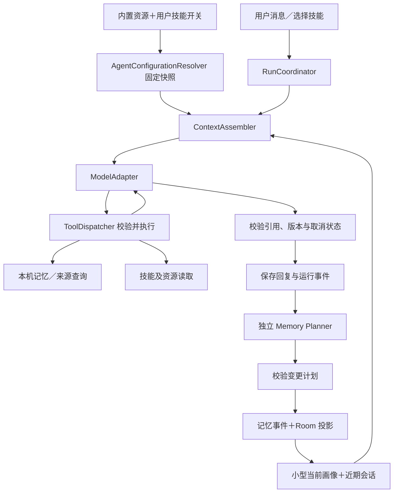

# 私人助手：身份、技能与记忆架构

日期：2026-10-10。状态：**下一版设计草案，尚未实现**。本文依据用户提出的 SOUL.md、应用内置且可启用／禁用的 skills、持续了解用户的私人助手需求；补充 [记忆 agent 调研](../memory-agent-research.md) 与 [事件架构](event-sourcing.md)。内置资源示例见 [模板说明](../examples/agent-workspace/README.md)。用户已明确技能随软件内置，取消先前的用户选目录方案。

## 1. 选择与当前基础

采用 **Kotlin 原生轻量 AgentRuntime**，沿用 Room、现有多 provider 配置、业务事件与本机文本搜索。借鉴 OpenClaw 的工作区／身份文件和 Agent Skills 的渐进加载，借鉴 LangMem 的记忆整理接口与 Memobase 的画像／时间线。不把 Node／Python agent 服务嵌入 APK，也不为此更换 Android 工具链。

0.4.0 已有私人助手入口、多轮聊天、已确认记忆上下文、候选审核、纠正／忘记与版本保护。`PersonalAssistant.execute()` 当前一次调用同时产生回复和候选；没有内置技能目录／开关、主动记忆工具循环或结构化 Memory Planner。支持 Responses／Chat Completions 不代表已经支持 function calling。本文所有新模块、事件名、技能加载和 UI 均为拟建能力。

目标是让助手能回答「你知道我的哪些习惯」「结合我正在做的项目给建议」「用已启用的技能做周回顾」，并准确更新变化，解释依据，遵守忘记要求。先做一个可靠的个人 agent，不增加多 agent 协作。

## 2. 四种内容分别管理

| 内容 | 职责 | 修改与存储 |
| --- | --- | --- |
| `SOUL.md` | 助手身份、交流风格、稳定边界 | 默认内容内置；用户在软件中编辑个性化版本，助手只提出修改草稿，由用户采纳；使用版本快照 |
| 内部 `AGENTS.md` | 做事方法、何时回忆、如何使用技能和反馈 | 随应用发布的运行约定，不能授予工具权限；与工程根目录的开发约束不同 |
| `skills/*/SKILL.md` | 可按需调用的任务方法，如周回顾、项目梳理 | 开发者加入应用资源并随版本发布；用户仅选择启用／禁用，调用时加载正文和必要资源 |
| 个人记忆 | 关于用户的事实、偏好、项目和经历 | 业务事件与独立正文为事实来源，Room 形成画像和检索投影 |

`USER.md`、`MEMORY.md` 可以作为画像／记忆的**手动导出视图**，不成为另一个可自由写入的主数据库。修改导出文件不直接改记忆；未来提供导入时，先形成有来源的候选，校验后走正常命令。私人聊天和记忆默认只存应用私有目录，不自动导出。

优先关系与信任边界：应用强制规则与 ToolRegistry 权限始终生效；当前用户要求决定本轮目标；SOUL／内置运行约定提供稳定默认值；选中的 skill 提供任务步骤。临时要求「这次详细讲」可覆盖默认简短风格，不意味着永久修改 SOUL。记忆、录音转写、引用文档和工具结果标记为数据，不提升为运行指令。skill 的 `allowed-tools` 也不能扩大应用权限。

「以后回答短一些」可成为明确的长期交流偏好；「我妈妈喜欢甜食」保存为其他主体的事实，不变成用户爱吃甜食。聊天中的事实不自动改写助手身份，也不推断人格、疾病或隐含关系作为已确认记忆。

现有 ANSWER 自定义提示词迁移为应用内可编辑的助手偏好草稿，保留旧版本和选择权。SOUL 管身份，能力提示词管特定任务输出，避免两处同时定义互相矛盾的人设；一次请求明确记录实际采用的版本。身份页提供恢复内置默认，不要求用户管理 Markdown 文件。

## 3. 应用内置资源与技能开关

开发者在工程的 `app/src/main/assets/agent/` 中维护身份默认值、运行约定和技能包，随 APK 一起发布。这里是拟采用的资源路径，当前示例仍在文档目录；不是让用户在手机上创建的工作区。不提供目录选择、SAF 授权、外部扫描或文件导入入口。

```text
app/src/main/assets/agent/
  catalog.json
  SOUL.md
  AGENTS.md
  skills/
    weekly-review/
      SKILL.md
      references/review-outline.md
    personal-planning/
      SKILL.md
```

`catalog.json` 是内置技能清单，记录稳定 skill ID、名称、版本、资源路径、bundle 哈希、需要的工具、默认开关与可选的互斥组。构建时校验清单与资源一致、ID 唯一及引用存在；运行时只加载清单内的技能。不会把开发仓库 `.agents/skills` 自动打包。资源中只有通用规则，私人身份修改、记忆与凭据保存在应用私有存储，不纳入源码库。

技能页列出所有内置技能。用户启用后，agent 才能自动匹配或手动选用；禁用后不向模型提供该技能的元数据、正文和资源，`load_skill` 也拒绝按 ID 绕过。开关只管理技能，不删除既有记忆，也不代替自动记忆、后台处理或对外发送的授权。基础查询／纠正／忘记属于记忆系统能力，不会因关闭「周回顾」而消失。

用户开关按稳定 skill ID 保存在 DataStore；应用升级保留已有选择，不因新默认值覆盖用户禁用。新技能采用清单声明的默认值；移除的技能不可调用。推荐首批内置「周回顾」「项目梳理」「行动规划」，默认启用但仅在任务匹配时使用；启用不意味着自动运行或后台联网。

每轮形成 `AgentConfigurationSnapshot`：身份／约定正文版本、启用技能版本及 bundle 哈希。一个运行固定这些内容，用户修改身份或启用新技能在下一轮生效。**禁用立即生效**：取消正在使用该技能的运行，在加载、工具执行和结果提交前检查最新禁用状态，迟到结果不能继续执行或展示为完成。相关已提交业务结果不因禁用而撤销；其他未使用该技能的聊天与录音继续运行。

技能资源相对包根解析，拒绝 `..`、绝对路径、跨包路径和循环引用。当前 APK 资源只读；校验失败的技能标为不可用。内置技能更新通过应用版本发布，不增加在线下载／插件安装流程。旧运行记录保留所用版本和必要内容引用，回放不从当前 APK 重新加载并执行旧技能；身份历史正文可按删除策略清理。

## 4. skills 的兼容范围

采用 Agent Skills 文件布局：`SKILL.md` 包含 YAML frontmatter，必需 `name`、`description`，可有 `license`、`compatibility`、`metadata`、实验性的 `allowed-tools`。校验必需字段、长度和目录名一致性；使用规范兼容的 YAML 解析器，不自行用正则拼一个解析器。未知元数据保留但不执行，重复关键字段和无效文件明确报错。

渐进加载：

1. 开始请求仅装入启用且可用技能的名称、描述和能力要求；超过预算按用户点选、任务匹配和最近使用排序，不能把整个目录塞进提示词。
2. 用户可点选已启用的技能，或用 `/weekly-review` 明确指定；自动匹配默认至多一个，确有必要时最多两个。明确指定已禁用技能时提示到技能页开启，不自动改变开关。
3. `load_skill` 返回固定版本正文；`read_skill_resource` 按需读 `references/` 与文本资产，引用相对 skill 根解析，不自动请求外链。
4. 默认单份 SOUL／AGENTS 不超过 32 KiB，SKILL 正文不超过 64 KiB，单资源不超过 128 KiB，每轮技能文本总量不超过 256 KiB；另有模型上下文预算，超限不给模型静默截断的半份规则。内置清单默认上限 200 个 skill，构建阶段阻止超限资源发布。

V1 支持说明型技能和基于原生工具的任务编排，**不执行 Bash、Python、Node、任意下载代码或安装依赖**。内置清单不发布依赖这些能力的技能；二进制资产不自动上传，后续增加图片／文档工具时另设格式与权限。

skill 是做事方法，不等于工具实现。开发者添加「周回顾」可复用原生查询工具，只需编写资源并随新 APK 发布；添加「发送邮件」的 SKILL.md 不会使手机获得发邮件能力，必须先增加受控原生适配器。`allowed-tools` 仅作为要求／限制，未知工具视为不可用；不支持桌面 Bash 权限表达式。普通本地读取不反复弹窗；本阶段不提供外部发送工具。

## 5. AgentRuntime 组成与执行



| 模块 | 责任 |
| --- | --- |
| `AgentConfigurationResolver` / `SkillCatalog` | 内置清单校验、用户开关、启用／可用状态、不可变快照与渐进加载 |
| `ContextAssembler` | 当前画像、任务所需记忆和有限会话；按预算组装，保留来源版本 |
| `ModelAdapter` | 将 Responses／Chat 的原生工具请求统一为有 ID 的 `ToolCall`，处理结果与流状态 |
| `ToolRegistry` / `ToolDispatcher` | JSON schema、能力约束、授权、参数校验、限额、幂等与调用回执 |
| `RunCoordinator` | 本轮状态、attempt、取消、预算、结果提交，继续使用进程级协程生命周期 |
| `MemoryPlanner` / 记忆命令服务 | 分离事实提取、检索已有事实、变更规划和业务提交；模型不直接写 Room |

初始工具为 `get_personal_profile`、`search_memories`、`get_memory_sources`、`search_local_sources`、`load_skill`、`read_skill_resource`、`propose_memory_changes`。来源工具只读用户允许的本机文本，返回有限片段、ID、版本、时间；不直接暴露文件路径、密钥或完整无关历史。记忆删除／纠正命令可由用户操作或显式授权意图发起，不由检索结果中的文字授权。

每轮先取小型画像和近期会话；缺少历史信息时模型调用查询工具。默认上限为 3 轮工具交互、6 次工具调用、120 秒总时限；读取工具返回最多 10 条候选、单来源最多 2,000 字符，累计工具文本最多 12,000 字符。整轮输入控制在配置上下文窗口的 60% 且默认最多 12,000 tokens，给输出留空间；不能可靠计数时采用保守字符预算。配置允许缩小上限；到达边界自然交付已完成部分，不循环到底。

ANSWER 继续使用用户为助手绑定的 provider／模型。增加真实工具调用能力声明与可手动触发的最小探测，不仅凭协议名称推断；工具调用 ID、参数 JSON、工具结果返回格式均须测试。能力不支持时降级为「固定画像＋检索上下文＋用户明确选中技能」的普通对话，不把模型输出中的伪 JSON／文本当作工具命令。页面说明主动回忆不可用，不暗换 provider。

Memory Planner 使用现有 MEMORY 能力的独立绑定；未配置时聊天仍可用，明确显示自动整理未启用，手动记住仍可用。背景整理默认关闭，用户开启后才通过持久化 AI 任务／outbox 执行；记录文本范围、费用相关调用数和所选模型，不默默另用 ANSWER 花费。

同一会话串行生成；不同会话受全局并发上限约束。运行不由 Activity 持有，折叠／重建不重发请求。进程退出后未完成的付费聊天显示「已中断」，用户重试新 attempt；不承诺云端只计费一次。工具幂等键为 `(runId, attempt, callId)`，本机事务检查命令状态，不能只依赖内存去重。

## 6. 记忆作为有证据的知识系统

分为四层：

| 层 | 内容 | 使用方式 |
| --- | --- | --- |
| 近期工作上下文 | 本轮与近期消息、未完成工具结果、会话摘要 | 有容量与保留期，不默认转成长期事实 |
| 关于我 | 明确的称呼、交流偏好、长期约束 | 小型当前画像常驻；超预算按显式重要性裁剪 |
| 正在做的事 | 项目、目标、计划、状态和待办 | 根据本轮话题按需加载，完成／取消与期限明确 |
| 经历时间线 | 有来源的事件、决定、状态变化 | 按日期、主题、主体检索，不全部视为当前状态 |

技能保存可复用的方法；「以后先给结论」属于用户偏好。记忆不会自行生成／安装技能。助手可提出 SOUL 改进草稿，由用户在应用内采纳；技能内容由开发者维护，运行中不会自改，用户只管理开关。

### 6.1 来源和结构

来源包括用户消息原文片段、用户手动记忆、录音转写修订及明确采纳的决定。来源记录 `sourceId`、`revision`、`origin`、片段边界、发生时间／时区、主体与关联项目。ASR 只是机器转写来源，不把识别结果称为用户已确认原文；更正转写使依赖旧版本的候选失效。

事实最小模型：`id, subject, predicate, valueContentId, kind, scope, status, observedAt, validFrom?, validUntil?, sourceRefs[], version`。例如用户的 `drink.coffee` 当前值与有效时间；自然语言正文仍通过内容 ID 引用。字段可缺省，迁移旧记忆时保留未知，不凭模型补造日期。谓词优先采用小型注册表，可扩展字段不能绕过来源校验。

`status` 区分候选、当前、已替代、失效、被拒绝、已忘记；时间到期仅停止当作当前事实，不等于彻底删除。经历不是过期的偏好，事实修订历史也不自动总结成用户经历。

画像由有效已确认事实确定性生成，不是无来源的模型简介。自由文本摘要是单独派生内容，必须有依赖；模型产生的性格解释只能作为待询问假设，不混入当前画像。

### 6.2 独立 Memory Planner

回复先完成；随后在用户启用的策略下，以尚未整理的有限来源批次、相关已有事实和原始发生时间提出：

- `ADD`：新的有证据事实。
- `REINFORCE`：相同事实的新有效来源，不重复造卡片。
- `SUPERSEDE`：明确的新状态替代指定旧事实，保存生效时间。
- `IGNORE`：重复、引用、假设、无证据推断或不需要长期保存。
- `ASK_USER`：来源冲突／时间不明，不能安全更新。

计划携带来源 ID／版本及证据片段、目标 ID／expectedVersion、主体、谓词、作用域、时间与输出格式版本。应用验证引用真实存在、片段匹配、来源未删除／修订、目标仍有效、旧版本一致、禁止规则和确认策略。格式错误／证据不符不会写入事实；批次记录失败，用户可重试。模型自报置信度用于排序参考，不能当正确率或覆盖授权。

先按主体／谓词／项目检索，再使用本机中文文本索引匹配同义候选；模型在有限候选中判断 ADD／合并／替代。不得把所有事实交给模型自由改写。合并保存多来源依赖；一个来源删除后根据其余有效证据重算，不简单留下原结论。

### 6.3 自动程度与真实反馈

默认：明确的「记住」「纠正」「忘记」按用户授权执行；普通对话推断形成候选。授权由当前用户消息／界面命令确定，工具调用和 skill 正文不能替用户授权。指代不明或冲突需要问清一次，不能因为出现“记住”两个字就自动提交引用内容。

可选「自动记忆」：允许保存直接陈述且来源完整的普通偏好／项目事实；敏感信息、间接推断与不明冲突仍候选审核。先上线默认策略，再用质量集验证自动策略。成功提交后才显示「已记住」；提出候选时显示「待确认」。用户可查看最近变更和纠正，而不是每轮弹一个冗长说明。

示例：「我喜欢咖啡」→ 当前偏好；「从今天开始不喝了」→ 根据消息发生日期提出替代，当前画像停止使用旧偏好；「只是今天不喝」→ 临时状态，不覆盖长期习惯。助手建议「每周跑三次」只有用户明确采纳时才形成计划。

### 6.4 无 Embedding 的主动回忆

检索链为：结构化条件（主体／项目／状态／时间）→ 中文二元字索引与关键词候选 → 简单可解释排序 → 必要时模型改写查询／重排有限 ID。使用 SQLite／Room 全文索引或配套中文索引，不引入向量后端。排序考虑文本匹配、当前有效性、来源质量和任务时间范围；不会仅因近期经常被用就永远压过更相关事实。

小型画像直接读取；详细经历与原文按需查。来源版本无效、被拒绝或已忘记的内容在索引、ID 读取和上下文组装三处都不可见。无匹配时说明暂时没有对应记录，并可询问用户，不编造长期熟悉感。

## 7. 忘记、来源删除与防复活

建立明确依赖关系：来源修订 → 事实 → 画像字段／会话摘要 → 使用这些内容的回复、运行上下文与候选。读取工具回执、草稿提示词、历史正文版本和检索副本也可能含私人内容，应存入可删除内容存储，不能藏在事件 JSON 或永久日志中。

区分三种意图：

1. **纠正／过期**：新事件更新当前事实，旧内容按保留策略可追溯。
2. **删除来源**：撤销该来源支撑；多来源事实按剩余证据重算，依赖旧摘要失效，不能保留无法证明的推断。
3. **忘记事实／主题**：清理相关正文和所有受影响的派生内容、索引与缓存，追加最小墓碑／阻止重新学习标记。原始录音或聊天是否一起删除由操作范围决定；保留原文时，检索和后续提取仍须遵守该标记。

正文指纹只防完全相同内容，不能解决同义表达复活。结构化事实使用主体／谓词／作用域级抑制；「忘记咖啡相关习惯」需要用户可查看的主题范围，不用不可解释的模型语义删除整个数据库。抑制记录本身可能透露主题，单独保护并最小化保留，不能声称它不含隐私。只有新的明确「重新记住」授权解除对应抑制；普通再次提及不解除。

新请求上传前检查删除／变更标记，查询工具返回前检查，回复和记忆提交前再次检查来源版本与相关知识修订。运行期间用户忘记时取消受影响运行、清理结果和上下文；迟到响应不展示／写回。已经发送到 provider 的内容无法靠本机删除收回，应用不再继续发送相关上下文。共享导出／旧备份需单独清理，本机删除不假装已远程删除。

## 8. 事件与持久化边界

拟新增业务事实包括 `AgentRunRequested / AgentAttemptStarted / AgentToolCallCompleted / AgentRunCompleted / AgentRunCancelled / AgentRunInterrupted`；记忆扩展 `MemoryReinforced / MemorySuperseded / MemorySourceWithdrawn`，沿用已有候选／确认／纠正／忘记语义。命名须在实现时对齐现有 schema，不直接更名旧事件。

事件引用 run、attempt、实际配置／skill 版本、可删除输入输出内容 ID、来源 ID 和版本；保存必要的工具调用回执与结构化变更，不存模型内部思维链。技能启用状态与预算放 DataStore；业务结果所用的快照引用和授权上下文进入运行历史。

业务命令先在同一 Room 事务中追加事件、更新投影和必要 outbox，提交后才调度。跨多个记忆的替代／合并计划检查全部 expectedVersion，原子提交，否则整项计划过期。纯 reducer 只消费事件和合法保留的内容，**不读取现在的 SOUL／skill 文件，不查询 provider，不创建任务或通知**。重放使用当时保存的事实，不重跑 Memory Planner。

内容发布后数据库提交失败留出孤立内容回收路径；彻底删除和事件重建能容忍已删除引用。投影重建与后台整理是独立入口。运行恢复不能通过回放工具事件重新执行工具；本地写入回执使用稳定幂等键，远端计费仍可能不确定。

## 9. 界面与迁移

设置增加「助手」，只保留三个简洁入口：**身份、技能、记忆方式**。身份页预览名称／风格并在软件中编辑；技能页用名称、一句短描述和启用开关展示内置能力，例如「周回顾：整理近期进展与下周重点」。不显示文件路径，不提供选文件夹或编辑 SKILL.md 的入口。点入才展示适用场景和必要工具；已启用但所选模型缺少工具能力时标明限制。模型连接仍复用现有 provider 页面。

记忆页以「关于我／进行中／经历」呈现；「待确认」作为数量入口，显示关键新增／替代差异及来源。对话默认显示自然回答，使用技能与记忆时提供一行可展开的来源入口，不铺出 agent 日志或大段配置说明。保存、待确认、失败与中断状态用实际业务结果驱动。

窄窗口是单页编辑和返回；展开窗口将列表与身份／技能／记忆详情放双栏，按实际窗口与折叠遮挡调整，保留输入、选中项和滚动位置。外屏／内屏切换不重启 run 或录音；IME 出现时保住编辑区和发送操作，不能让解释卡片挤掉主要内容。

迁移保留 0.4.0 记忆 ID、来源、确认状态、删除标记与正文；无结构字段的旧记忆先作为可用文本事实，字段缺失标为未知，用户或后续有证据整理才补足。新画像是投影，不能把旧候选批量升为事实；已有忘记规则优先于新检索。旧 ANSWER 继续可用，内置技能和工具能力逐项接入。

## 10. 开发顺序与验收门槛

| 阶段 | 实际交付 | 验证重点 |
| --- | --- | --- |
| A：身份与内置技能 | APK 内置 SOUL／运行约定／技能清单、应用内身份编辑、技能开关持久化、按需加载与显式选中 | 清单／YAML／资源校验、重复 ID、路径越界、禁用技能不可按 ID 调用、运行中禁用与迟到响应、重启／升级保留开关、超限资源、折叠和输入保留 |
| B：主动回忆 agent | ModelAdapter 工具协议、有限工具循环、本机记忆与来源查询、能力降级、取消与回执 | 两种协议的工具 ID／返回格式、无工具模型、重复工具、达到预算、取消／进程退出、工具查询不暴露忘记内容 |
| C：可靠的记忆整理 | 独立 MEMORY Planner、结构化冲突、替代／多来源、画像与依赖清理、默认候选策略 | 同义去重、主体错误、引用／假设、偏好反转、临时状态、相对日期、未采纳建议、过期计划、来源删除、忘记后同义重提 |
| D：持续了解与评估 | 用户可选自动记忆、授权后台批次整理、可删会话摘要、近期变更视图 | 重复批次、版本竞争、后台费用控制、删除派生图、合成长期对话质量、不同模型稳定性 |

每阶段验证实时投影与重建一致；为重建路径使用一调用就失败的网络／文件加载／调度替身，证明不会触发副作用。schema 迁移、已删除内容和旧请求迟到单独覆盖。真实模型评估与 mock 格式测试分开报告，使用合成非私人样本；报告误记、漏记、错误覆盖、召回和成本，不靠主观“更懂我”判定。

本轮仅完成架构与模板检查，不更新 APK、不运行 Gradle，也不把上述验收表记为测试通过。

## 11. 固定快照来源

本次读取上游公开文件，未安装或执行上游 agent。参考思想后自行编写本项目文档与模板；如将来移植源码，需另核对许可证与保留要求。

- OpenClaw（GitHub 许可证标识 MIT），快照 `f18b305771d7e896d797945e4f4e6b0d22acc1b0`：[SOUL 模板](https://github.com/openclaw/openclaw/blob/f18b305771d7e896d797945e4f4e6b0d22acc1b0/docs/reference/templates/SOUL.md)、[工作区](https://github.com/openclaw/openclaw/blob/f18b305771d7e896d797945e4f4e6b0d22acc1b0/docs/concepts/agent-workspace.md)、[技能加载](https://github.com/openclaw/openclaw/blob/f18b305771d7e896d797945e4f4e6b0d22acc1b0/docs/tools/skills.md)。借鉴职责分离、元数据／正文按需加载及版本边界；不照搬自改身份、私人 Git 记忆或脚本运行环境。
- Agent Skills，快照 `69ef37e9424c0a7ea9dd2293b559e43ec8176379`：[文件格式、渐进加载与相对资源规范](https://github.com/agentskills/agentskills/blob/69ef37e9424c0a7ea9dd2293b559e43ec8176379/docs/specification.mdx)。本文明确 Android 支持的子集，不宣称兼容任意桌面 skill。
- LangMem／Memobase／Letta／Mem0 的源码、许可证标识与本项目采用边界见 [既有调研](../memory-agent-research.md)。
