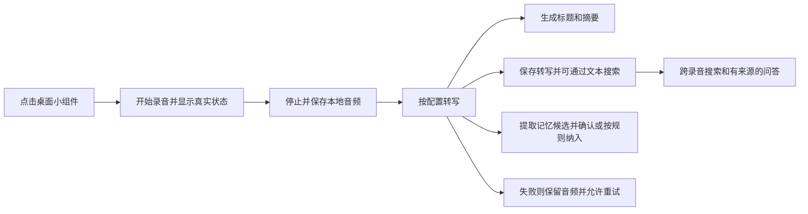

安卓 AI 录音与个人记忆应用：需求分析草案 v0.6

实施进展：本地 M4A 录音阶段已建立工程并完成模拟器验证，见 [首个录音版本交付](first-recording-delivery.md)。下文开源调研和“尚未开发”表述保留原调研快照的时间边界。

调研日期：2026-10-09（Asia/Shanghai）。当前交付包含需求分析、开源选型建议、开发环境检查与事件溯源方案，未初始化版本库、创建 Android 工程、编译候选应用或进行真机测试。

**产品定位与已确认需求**

这是一款面向个人的原生 Android 语音记录工具：通过桌面小组件快速捕捉想法，自动转写、生成标题和摘要，并把历史录音组织成可查证、可维护的个人记忆。

| 项目 | 已确认内容 |
| --- | --- |
| 首要场景 | 随手记录想法，通常几秒到几分钟 |
| 核心入口 | 桌面小组件，减少开始录音前的操作 |
| AI 功能 | 语音转文本、智能标题、总结、跨录音搜索与问答、人物／项目／偏好等长期记忆 |
| 搜索方式 | 本地文本搜索，重点覆盖语音转写正文，兼顾标题／摘要／标签；不使用 Embedding 或向量检索 |
| 第一版 AI 部署 | 自定义云端或自建 API；手机离线模型安排在后续版本 |
| 可迁移性 | AI 配置可导入导出；建议同时覆盖录音、文本与记忆的数据备份 |
| 平台 | 纯原生 Android；Kotlin、Jetpack Compose；本地模型后续可使用 NDK/JNI |
| UI 组件选择 | 已确定使用 Google 官方 Material 3 Expressive，采用简洁风格；当前处于需求阶段，尚未接入工程 |
| 设备 | 用户提供的 vivo X Fold 6；要求折叠屏适配 |
| 版本管理 | 使用 jj（Jujutsu）；建议采用 Git 后端与 colocated 工作区 |
| 业务持久化 | 核心业务采用 Event Sourcing：录音、AI 处理、记忆变更；普通设置与临时 UI 状态不要求事件溯源 |

下文将已确认需求、建议默认值和待验证事项分开表达。暂以中文为主要语言，兼顾中英混说；具体方言、手机系统版本及分发方式仍待确认。不依据设备名称推断处理器、屏幕分辨率、Android 或 OriginOS 版本。

**开源调研与复用判断**

检查了 GitHub 仓库信息、README，并对部分项目的小组件、录音服务、备份与构建文件进行源码抽查。表中的推送日期是仓库活动线索，不代表稳定版发布时间或质量结论。未发现经本次检查即可确认完整满足全部需求的现成项目。

| 候选 | 已查证能力与技术 | 许可证与状态 | 对本项目的判断 |
| --- | --- | --- | --- |
| [Transcription](https://github.com/totec448-spec/Transcription) | Kotlin、Compose；小组件／通知录音；M4A 本地归档；多家云转写；可编辑清理提示词；音频导入与便携备份 | 自身 Apache-2.0；含 LGPL-3.0 的 FFmpegKit 依赖；最近推送 2026-09-30 | 与第一版流程最接近，优先评估整应用二次开发。当前服务商和文本清理流程有绑定，仍需增加通用配置、标题／总结、两类记忆和折叠屏适配；项目规模较小，不能仅凭 README 判断可靠性 |
| [Dimowner/AudioRecorder](https://github.com/Dimowner/AudioRecorder) | 原生 Java／Kotlin；录音、播放、波形、音频导入、书签、小组件；源码有麦克风前台服务和启动 Activity | Apache-2.0；最近推送 2026-09-30 | 录音模块优先复用候选。仓库处于 Kotlin／Compose／Room v2 改造期，旧新实现共存，需先确认采用版本，不能将整个仓库视作纯 Compose 成品 |
| [Fossify Voice Recorder](https://github.com/FossifyOrg/Voice-Recorder) | Kotlin 原生；本地录音与播放；桌面小组件；已有启动 Activity 和录音服务 | GPL-3.0；最近推送 2026-10-08 | 持续维护的整应用候选，适合接受 GPL 分发要求时二开；AI、记忆和新的自适应布局需要补充，界面并非 Compose 底座 |
| [Vox Transcribe](https://github.com/Danmoreng/vox-transcribe) | Kotlin、Compose、Room；本地实时转写、文本整理、标题和总结 | MIT；最近推送 2026-07-17 | 可参考录音到笔记的工作流。当前绑定本地模型，README 的语言选项为自动／英／德，未验证中文；模型需数 GB 存储，偏离第一版云端 API 方向 |
| [voice-notes-android](https://github.com/goalhunter/voice-notes-android) | Android 示例位于 whisper.cpp 派生仓库内；Kotlin、Compose、Room；README 展示本地转写、摘要、语义检索与问答 | MIT；最近推送 2025-12-17 | 可参考“录音→检索→回答”的组织方式；不是已经验证可用的中文记忆底座，默认检索模型的中文效果、模型获取和维护情况需另验 |
| [sherpa-onnx](https://github.com/k2-fsa/sherpa-onnx) | Android／Java／Kotlin 集成；有中文及多语言 ASR、VAD 等模型路线 | 引擎 Apache-2.0；最近推送 2026-10-09 | 后续手机离线转写的优先评估对象；原生集成可用，不必采用其 Flutter 示例；具体模型权重另查许可 |
| [whisper.cpp](https://github.com/ggml-org/whisper.cpp) | C/C++ 推理引擎；已有原生 Android 示例；支持多语言 Whisper 模型 | MIT；最近推送 2026-10-07 | 后续离线转写的另一候选。中文使用多语言模型，不能误选仅英语的 .en 模型；速度、发热和准确率需真机对比 |
| [Record You](https://github.com/you-apps/RecordYou) | Kotlin、Compose、Material 3；原生录音与播放 | GPL-3.0；已归档，README 明确停止维护；最近推送 2024-08-08 | 可参考界面，不推荐作为长期主底座 |
| [Transcribro](https://github.com/soupslurpr/Transcribro) | Kotlin；基于 whisper.cpp 的离线语音输入键盘与服务 | ISC；最近推送 2026-09-29 | README 明确当前仅支持英语；不是中文录音与记忆应用的直接替代品 |
| [MyBrain](https://github.com/mhss1/MyBrain) | 笔记、任务、AI 助手、备份／同步思路；当前 README 为 Kotlin Multiplatform、Compose Multiplatform，现阶段目标 Android | GPL-3.0；最近推送 2026-10-03 | 可参考个人知识管理体验；与纯 Android 单平台底座要求不完全一致，不作为主工程候选 |

建议下一阶段先验证 Transcription 能否低成本二开，重点检查后台录音可靠性、去除服务商绑定的改造量、数据模型能否扩展及依赖情况。现已确定核心业务事件溯源，还需核对候选项目的写入路径与后台任务是否容易迁移；不能仅因流程接近就直接沿用其持久化设计。如果改造牵连太大，再采用 Dimowner 等项目的录音实现作为复用起点，组合官方 Jetpack 组件建立应用。Fossify 是接受 GPL 路线时的备选。

复用顺序建议是：先复用整条已验证的工作流，其次复用录音与存储模块，再使用现成推理引擎。标题、摘要、记忆规则和配置格式属于本产品需要明确设计的部分。代码许可、依赖许可与模型许可分别核对；GPL 代码不能复制后统一改标为 Apache 或 MIT，个人自用与对外分发的义务不同。

**核心使用流程与第一版范围**

建议首次使用先完成麦克风授权和录音入口说明；AI 可以稍后配置。没有 API Key、没有网络、模型服务不可用，都不应阻止本地录音和回放。

音频、转写和各 AI 任务分别保存状态。一项任务失败不能把整条记录标成失败，更不能删除原音频。标题、摘要与记忆提取可以共享一次文本模型请求以降低开销，但逻辑上保留独立配置与重新生成入口。

ASR（语音识别）负责把录音转成文字；保存后的转写正文可以直接在本机搜索，不必等待标题、总结或记忆生成。已有文本的搜索不联网，也不需要额外的 AI 服务。尚未转写的录音可以按已有标题／标签查找，并明确显示待转写状态。

| 编号 | 第一版要求 | 建议行为与边界 |
| --- | --- | --- |
| R01 | 小组件快速录音 | 权限就绪后点击即启动；提供紧凑按钮与较大控制组件，具体尺寸按桌面网格适配；录音中显示停止／保存，较大组件增加暂停；重复启动不创建第二个会话 |
| R02 | 可靠本地录音 | 启动、暂停、继续、停止；录音时长和真实采集状态；常驻录音通知；音频写盘成功才反馈“已保存”；应用界面退出不结束已启动录音 |
| R03 | 本地录音库 | 时间线、播放、重命名、标签、删除与恢复；录音默认使用日期时间作为临时标题；AI 未完成时仍可查看 |
| R04 | 转写 | 停止录音后按设置自动执行，也可手动执行；保留原始识别文本和人工修订；中文优先，语言可选；网络失败可重试 |
| R05 | 智能标题 | 建议生成简短中文标题；用户手动改名后，重新生成只给建议，不直接覆盖 |
| R06 | 总结 | 短记录给简短摘要，较长记录给要点；待办与日期只在有原文依据时提取；不为了填满模板添加内容 |
| R07 | 文本搜索与跨录音问答 | 搜索转写正文、标题、摘要、标签，支持时间筛选；显示匹配片段并进入原记录；问答基于文本检索结果或用户选定录音，展示来源引用 |
| R08 | 长期记忆 | 提取人物、项目、偏好、约定、待办等候选；可确认、编辑、禁用、合并和删除；保留来源及更新历史 |
| R09 | AI 配置 | 多服务商／多模型配置；每项能力单独绑定；预设与自建地址；自定义提示词；连接检查与明确错误提示 |
| R10 | 导入导出 | 配置 JSON、单条或批量内容导出、完整备份与恢复；导入已有音频；恢复时保留关联关系并处理重复 |
| R11 | 折叠屏 | 外屏单栏、内屏按实际窗口决定分栏；内外屏切换保留录音会话、当前记录、编辑草稿与阅读位置 |
| R12 | 可恢复处理 | 队列持久化；断网等待；错误可定位到服务和步骤；任务重跑不重复创建录音或记忆；旧任务结果不覆盖新编辑 |
| R13 | 核心业务事件溯源 | 录音、AI 任务和记忆由业务事件保存历史；当前查询状态可重建；回放事件不触发录音、联网或任务入队；支持事件版本演进与彻底删除 |

建议第一版同时具备两种记忆的最小完整体验。实时字幕、多说话人分离、复杂会议纪要、跨设备自动同步、桌面端、系统级语音助手与手机离线模型作为后续范围。普通麦克风录音是当前目标；电话通话录音和其他应用内部音频捕获需要另外定义，不能由“录音软件”默认推导为支持。

**快速录音与 Android 平台边界**

Android 官方文档列出了用户点击小组件／通知触发服务的相关例外。因此小组件直接启动麦克风录音有实现路径，但“允许后台启动前台服务”与“满足麦克风使用时权限”是两组要同时核对的规则。[A1][A2]

推荐产品行为：授权完成后，一次点击即可启动；必要时短暂显示轻量录音界面处理权限或启动失败，无需用户再点一次录音。直接启动服务与经过可见 Activity 的路径，应在当前 target SDK 和 vivo 系统上比较验证。首次未授权时进入授权流程，拒绝后保留清晰的再次授权入口。

录音使用 microphone 类型前台服务，声明相应服务权限与 RECORD_AUDIO。小组件、页面和通知共享同一录音状态源，不能各自管理一次录音。通知权限与麦克风权限分别处理；通知被关闭时明确可用的停止入口，不把“麦克风权限已授予”误当成所有条件已满足。

系统可能因通话、其他应用占用麦克风或隐私开关而让采集失败或产生静音。需要监听相关状态，提示录音受影响，并保存可用内容，不能只让计时器继续运行造成“正在录到声音”的假象。[A6]

息屏、切到后台和折叠切换应继续录音；系统强行终止进程、用户强制停止应用时不能承诺录音仍继续。异常终止后的目标是恢复已经持久化的片段并标明中断，不能未经验证就承诺单个未封装完成的 M4A 完整可恢复。

vivo 的后台、电池和自启动策略列入真机验收。设置引导需要依据实际 OriginOS 版本确认，不预写不存在的菜单路径。不得假设普通 Android 应用一定能获得系统录音器相同的后台待遇。

**AI 配置应以能力为单位**

“支持某家聊天模型”不等于“支持这家的语音转写”。建议每个连接配置包含服务类型、地址、鉴权方式、模型、必要请求参数和已验证能力；每项 AI 功能绑定其中一个配置。文本搜索使用本地数据库，无需模型配置。

| 能力 | 输入与输出 | 配置要求 |
| --- | --- | --- |
| 语音转写 ASR | 音频 → 文本；可选分段时间戳 | 服务地址、模型、语言、格式／大小／时长限制；标明同步／异步、时间戳和说话人能力 |
| 智能标题 | 转写 → 标题 | 模型、语言、长度偏好、提示词；可与总结共用默认配置 |
| 内容总结 | 转写 → 摘要／要点／待办建议 | 输出模板、提示词、上下文限制；内容较长时分段处理 |
| 记忆提取与更新 | 转写及相关旧记忆 → 有来源的记忆候选 | 模型、抽取类型、自动纳入规则、结构化输出校验 |
| 记忆问答 | 问题及文本检索片段／用户选定录音 → 带引用的回答 | 模型、检索范围、上下文预算；支持只查某项目／时间段 |

设置层分成“连接”“模型与能力”“提示词／流程模板”三部分。提供默认模板便于开箱使用，同时允许细调。可保存多个个人配置，例如“快速便宜”“高质量”“家中自建”。

第一版应支持明确协议的兼容接口与经过测试的服务商适配器。通用地址、模型名、自定义必要请求头和路径可配置，但不承诺只填一个 Base URL 就能兼容任意厂商；异步上传、签名鉴权或 WebSocket 等协议需要相应适配器。未知配置导入后标为待配置，不静默切到别的服务。

手机直接连接用户选定的服务，不强制依赖应用作者的服务器；自建服务需手机网络可达，手机上的 localhost 指手机本身。局域网 HTTP 如需支持应作为单独连接选项处理，不能全局放宽所有连接；HTTPS 保持证书校验。

首次选择云端／自建配置时说明处理去向：ASR 发送音频，标题、摘要、记忆与问答服务发送相应文本。普通文本搜索在本地执行。允许只录音、自动处理、手动处理，以及按记录排除记忆提取和问答上下文。跨服务自动回退默认关闭，用户配置后才启用。

API Key 由 Android Keystore 保护的本地密钥加密保存，日志与普通配置导出不包含密钥。连接检查区分地址、鉴权、模型、格式、限额等错误。自动重试限制次数；应用端避免重复落库，但不承诺消除服务商端重复收费的所有可能性。

**记忆的数据含义与用户控制**

跨录音问答回答的是“以前说过什么”；长期记忆管理的是“目前认可什么”。两者需要共享来源，但不能把一次摘要直接当作长期事实。

例如，录音“下周想试试周三健身”可以形成想法或待办候选，不能自动变成“我每周三都健身”的稳定习惯。如果后来录音改为“改到周五”，新旧信息应保留时间关系或显示待处理冲突，而不是悄悄叠加两个结论。

建议的最小数据对象：

| 对象 | 关键内容 |
| --- | --- |
| 录音 | 稳定 ID、录制时间与时区、音频文件、时长、标签、录音状态 |
| 转写版本／片段 | 所属录音、文本、原始或修订版本、可用的起止时间戳、语言 |
| AI 结果 | 类型、来源文本版本、模型与模板版本、生成状态、是否已被用户修改 |
| 记忆条目 | 类型、内容、来源引用、发生／生效／更新时间、候选／确认／失效状态、历史版本 |
| 文本搜索投影／索引 | 来源记录与片段、当前有效文本版本、可搜索字段及匹配位置；可从保留内容重建 |
| 处理任务 | 所属记录、步骤、配置快照、重试与错误信息、输出版本 |
| 业务事件 | 稳定事件 ID、聚合及版本、事件类型与结构版本、发生／记录时间、来源关联、必要内容引用 |
| 待执行任务 outbox | 与事件同事务登记的执行意图；幂等键、调度状态与尝试信息；不替代 AI 任务的业务历史 |

核心业务的事实来源是事件及其引用的内容版本，上表中的录音当前状态、记忆当前状态和处理状态由 Room 查询投影提供。正文和音频独立保存，以支持内容版本管理与彻底删除；索引允许重建。具体边界与一致性规则见 [事件溯源方案](architecture/event-sourcing.md)。

建议默认自动生成记忆候选，用户可批量确认，也可开启指定类型的自动纳入。候选和已确认内容应可区分；模型自报的置信度不能当作事实正确率。不从单次提及推断身份、关系或长期偏好。

问答必须展示检索到的依据；没有依据时说明未找到。支持从引用回到录音和原文。如果转写服务提供分段时间戳，可跳到对应音频位置；否则只能定位到记录／文本片段，不能编造秒数。生成的标题和摘要也保留原文入口。

中文搜索以连续文字片段匹配为基线。例如转写包含“下周去上海出差”，输入“上海”应能找到这条录音，显示并突出匹配片段。默认搜索当前有效的转写版本，人工修订后及时更新；结果可结合时间筛选并跳回原文。数据量增加时可采用经过验证的中文全文索引，不能把 SQLite 默认分词器当作已解决中文搜索。

跨录音问答使用文本检索结果或用户明确选定的录音作为上下文；找不到依据时提示调整关键词或选择记录，不凭空补充内容。本项目不引入 Embedding 模型、向量数据库或按语义相似度召回，也不将其保留为默认后续开发项。

原文修改后，关联摘要、记忆和索引应标为待更新或生成新版本，避免继续使用旧内容。删除原录音时，默认联动清理仅来源于该录音的记忆与索引；多来源记忆保留其他有效来源。支持单独“忘记这条记忆”，避免原记录再次处理时立即重建同一已拒绝条目。回收站与彻底删除分开；彻底删除必须清理历史正文及派生副本，不能只追加删除事件却仍让旧内容可以被重建。

日期解释以录音发生时间和时区为依据。例如离线录完几天后才转写，“明天”仍以原录音时间计算；语意不确定时保留原话，不能自动补造截止日。待办是记忆中的一种对象，第一版不自动创建外部日历事件或发送提醒消息。

**导入导出与恢复**

| 类型 | 建议格式 | 需要保存的内容 |
| --- | --- | --- |
| AI 配置共享 | 有 schemaVersion 的 JSON | 连接参数、模型绑定、提示词、流程设置；默认不含 API Key |
| 单条／批量内容 | 原音频、TXT、Markdown、结构化 JSON | 标题、时间、转写、摘要、标签、来源引用；时间戳存在时可增加 SRT／VTT |
| 完整备份 | ZIP 容器，含 manifest、版本化事件／内容数据与音频 | 稳定 ID、事件及结构版本、仍保留的内容版本、记忆来源／历史、配置、文件校验值；可提供不含音频的精简导出，但不能称为完整可播放备份；可选密码加密包 |
| 外部音频导入 | 优先 M4A、WAV、MP3 | 保留原始音频，建立录音记录后选择是否转写；不支持的编码明确提示 |

配置共享与个人备份是两个入口。密钥默认由用户在新设备重填；若未来支持携带密钥，使用单独密码加密导出，不能复制依赖旧设备 Keystore 的密文假装可跨设备恢复。

导入前显示版本、内容数量和冲突策略；默认合并且不覆盖已有人工修改。使用稳定 ID 和内容校验处理重复导入；同一聚合版本出现不同事件时报告冲突，不直接按时间覆盖。路径访问、解压大小、文件类型及格式版本必须验证。取消、损坏或不兼容导入不得破坏原有数据。

备份需要取得一致的事件与内容快照，不能随手复制运行中的数据库而遗漏 WAL、音频、正文版本或来源关系。查询投影和文本搜索索引可以不纳入备份，因为能够在本地重建；恢复后明确重建状态。事件回放本身不联网；未完成 AI 任务默认待恢复，用户继续后才上传或调用服务。恢复旧备份可能重新带入此前删除的内容，需在导入时说明。首版不以自动云同步替代用户可控导出。

**折叠屏体验方案**

使用 Material 3 Expressive 组件与统一主题，结合 Material 3 Adaptive／WindowManager 按实际可用窗口宽高及折叠姿态决定布局。内屏空间足够时采用列表／详情双栏，窗口变窄时回到单栏；以内容可读性判断分栏，不硬编码 vivo 型号或屏幕像素。[A3][A4][A5][A8]

| 情境 | 建议界面 | 必须保住的状态 |
| --- | --- | --- |
| 合拢后的外屏 | 单栏时间线；录音主按钮容易触达；详情内部切换原文／摘要／记忆 | 当前录音和当前查看对象 |
| 展开且窗口足够宽 | 左侧录音列表，右侧详情；核对时可并排显示原文与摘要或记忆候选 | 选中条目、音频播放位置、来源关系 |
| 分屏或窄浮窗 | 根据剩余空间回到单栏，保留返回入口 | 编辑草稿、选区、阅读滚动位置 |
| 半折姿态 | 若系统报告适合的折叠特征，再分配展示区和操作区；内容及触控避开实际遮挡 | 连续录音与可达的停止按钮 |
| 打开键盘／大字体 | 优先保障正在编辑的文本与主要操作，必要时收起辅助栏 | 输入焦点和未保存内容 |

录音生命周期独立于 Activity／Compose 页面。折叠导致界面重建时继续连接同一个录音会话，不重复开始或结束录音。AI 结果异步返回时仍归属原记录，不跳转用户正在查看的另一条内容。

小组件另行按桌面分配的尺寸适配，使用 Glance 或 RemoteViews 均可。Glance 与应用内 Compose UI 不是可直接混用的控件体系。[A7] 小组件重点显示状态、时长和控制，不依赖高频全量刷新来绘制实时波形。

**推荐技术方向与实现顺序**

已确定采用 Kotlin + Jetpack Compose + Material 3 Expressive 构建原生界面，核心业务采用事件溯源，代码使用 jj 管理。折叠布局使用 Material 3 Adaptive／WindowManager。其余建议为：录音采用 Android 音频 API 和 microphone 前台服务，回放采用 Media3；Room 保存事件、查询投影与 outbox，核心写入在同一事务内提交；DataStore 管理普通设置，Keystore 保护密钥；网络通过可替换的 Provider 适配器访问。第一版使用本机数据库，无需另建事件服务器。

**已确定的 UI 方向：Material 3 Expressive，简洁风格**

用户于 2026-10-09 确定采用 Material 3 Expressive。它是 Material 3 的演进，涵盖主题、组件、排版、形状和动效；通过官方 Compose Material 3 实现使用。[A8] UI 组件选型已完成，后续开发在这一体系内组织录音、记忆和设置页面。

以下为“简洁风格”的建议落实方式，具体颜色和尺寸在界面设计时细化：

| 设计维度 | 建议规则 |
| --- | --- |
| 配色 | 中性背景与文字，采用一种低饱和主强调色；错误和录音状态使用清晰的语义提示，文字／图标与颜色共同表达状态 |
| 层级与留白 | 通过字重、间距和少量色阶建立层级；标题、次要信息、主要操作各有明确位置，录音按钮保持突出 |
| 列表与容器 | 录音首页采用按日期分组的简洁列表；摘要、记忆候选等独立内容按需使用低强调卡片；以留白和细分隔线划分相邻内容 |
| 圆角与形状 | 使用统一的形状尺度；录音主操作可采用更鲜明的 Expressive 形状，其余容器保持克制 |
| 动效 | 用短促、连续的状态过渡解释按压、展开、保存与页面切换；尊重系统动画设置，减少长时间阅读时的视觉干扰 |
| 主题 | 支持浅色、深色和跟随系统；默认使用稳定的应用配色，可提供可选动态取色，保持正文和状态的对比度 |
| 触控与阅读 | 保证主要操作触控区域、中文长标题、大字体和系统键盘下的可用性；核心录音操作保持直接可达 |

| 页面或能力 | Material 3 组件方向 | 原生实现需要补齐的行为 |
| --- | --- | --- |
| 录音控制 | 醒目的录音主按钮，暂停／停止按钮，文字状态与时长 | 原生录音服务状态绑定、触控反馈、开始／暂停／停止可辨认；波形按需绘制 |
| 录音列表与详情 | ListItem、分隔线、标签页、菜单；宽窗列表／详情布局 | 外屏单栏与内屏分栏、列表性能、来源跳转和播放状态保持 |
| AI 配置 | 文本输入框、多行输入、下拉菜单、Switch、分组设置项 | 系统键盘、密码可见性、输入校验、长模型名与中文布局；高级参数按需展开 |
| 记忆候选 | 低强调卡片、文字标签、Checkbox、Dialog | 来源展示、批量确认、编辑、冲突处理与撤销 |
| 处理反馈 | 进度指示器、步骤状态文字、Snackbar | 清晰区分排队、执行、成功与失败；未知进度采用不确定进度指示，持续任务保留可查看状态 |

依赖以官方 `androidx.compose.material3:material3` 与匹配的 Compose 版本为基础，具体版本在工程建立时按所需 Expressive API 核对；自适应布局库单独管理兼容版本。实验性 API 若确有需要，在局部封装并注明使用范围。组件能力、中文输入、大字体、无障碍和折叠布局需要实际验证。

桌面小组件使用 Glance／RemoteViews，以相同设计变量保持视觉一致；应用内 Compose 组件不能直接作为 Android 桌面小组件使用。本轮只更新需求与选型证据，未创建 Android 工程或添加任何组件库依赖。

录音服务负责实时采集；WorkManager 适合管理可延迟、可恢复的上传与 AI 后处理，不能拿它承担“一点立即开始”的持续录音。系统调度可能延后处理，应用展示真实队列状态。模型加载、数据库迁移以外的非必要初始化和联网检查应避开录音启动关键路径。

1. 先验证候选底座：构建、真机小组件启动、后台与折叠连续性、中文短音频转写、自定义 API 和事件溯源改造边界、许可证与依赖。通过后固定复用版本。
2. 从“小组件 → 录音服务 → 音频保存 → 事件与查询投影 → 列表与回放”开始，验证事件重建、幂等与 outbox；随后补齐云端／自建 AI、标题与总结、两类记忆、导入导出与折叠屏，完成第一版范围。
3. 增强记忆与处理：中文文本搜索性能与筛选、冲突合并、批量整理、长音频分段与时间戳对齐；依据使用反馈安排。
4. 接入手机离线能力：比较 sherpa-onnx 与 whisper.cpp 的中文模型；单独评估本地摘要、记忆提取和问答所需模型，允许本地转写加远端总结等混合配置。

当前不做精确工期或性能承诺。底座改造量、真机系统行为、中文识别效果以及服务商协议是影响估算的主要未知数。

**建议验收标准**

这些是待实现后的验收要求与目标，尚未实测通过。

| 场景 | 验收结果 |
| --- | --- |
| 小组件启动速度 | 权限已授予、存储正常时，无第二次录音点击；建议目标：从点击到开始真实采集，暖启动 p95 ≤ 1 秒、冷启动 p95 ≤ 2 秒；在目标设备多次测量后校准 |
| 无网／未配置 AI | 能开始、停止、保存、回放；AI 显示待配置或等待网络，不阻塞录音 |
| 连续操作 | 多次点击开始只存在一个会话；快速开始／停止、空录音和极短录音给出明确结果，不丢已有记录 |
| 折叠与后台 | 同一段录音中多次展开、合拢、切后台、息屏及切换分屏，正常系统条件下无重启录音、重复文件或可听断点；建议包含 30 分钟连续采集测试 |
| 采集受阻 | 麦克风隐私开关、来电或其他录音应用占用时可感知状态变化，保留已录内容，不无提示地产生长时间静音 |
| 异常与存储不足 | 已完成片段可恢复；中断明确标注；空间不足提前提示，不能把落盘失败反馈成成功 |
| 中文短录音 | 用约 20 条真实样例覆盖安静、街道噪声、中英混说、专名、数字和否定句；记录字符错误与关键信息错误，随后确定可接受阈值 |
| 转写文本搜索 | 转写完成后输入正文中的中文连续片段可以找到录音并显示匹配位置；断网可搜已有文本；不依赖摘要完成；人工修订更新结果，删除内容不再出现；未转写时明确标注 |
| 标题与摘要 | 短记录不过度扩写；无依据不添加人物、金额、结论或日期；用户修改不被自动覆盖 |
| 记忆问答 | 每个事实性回答能指向真实来源；未找到时明确说明；无时间戳时不伪造音频定位 |
| 长期记忆 | 能拒绝／修改／撤销候选，处理新旧冲突；删除来源后，索引和相关记忆按规则更新 |
| API 与任务恢复 | 配置可分别绑定；鉴权失败、限流、超时、无效结构化响应、进程重启均可恢复或明确失败；重试不重复落库 |
| 配置与数据迁移 | 从旧设备导出，在干净安装中导入，录音可播放、文本完整、记忆引用有效；再次导入不重复；普通配置不泄露密钥 |
| 自适应界面 | 外屏、内屏、横屏、分屏、键盘、大字体和深色主题均能完成录音、编辑和来源查看 |
| 简洁视觉与反馈 | Material 3 主题与组件一致；主要录音操作清晰可见；浅深色及动态取色下正文和状态可辨认；系统关闭动画后仍能理解状态变化 |
| 事件回放与幂等 | 清空查询投影后可重建相同业务状态；不触发麦克风或 AI；重复命令／结果不重复落库，并发旧版本写入不静默覆盖 |
| 事件版本与彻底删除 | 支持约定的旧事件版本；未知版本明确拒绝或隔离；彻底删除后重建不恢复历史正文，已拒绝记忆不自动复活 |
| 任务与备份恢复 | 事件事务提交后、调度前退出仍可找回任务；导入备份不自动执行未完成 AI 请求或产生费用 |

**进入开发前需要补齐的少量信息**

手机的实际 Android／OriginOS 版本和可用内存；首批要接入的 ASR／文本模型服务及其协议；主要语言是否包含方言；应用计划仅个人自用、公开开源还是可能闭源分发。这些会影响真机矩阵、适配器和开源底座，当前可以继续保留接口边界而不作假设。

桌面点击即开始录音、默认保留原音频、自动产生记忆候选、普通导出不包含密钥，是本分析的建议默认值，尚非用户逐项确认的产品决定。

已检查的本机环境、jj 初始化与日常命令、各项信息最晚需要时间以及首阶段安排，见 [开工准备清单](development-readiness.md)。

**来源与检查边界**

开源项目来源均在候选表中链接。以下源码用于核实实现，而非仅依赖项目宣传：

- [Transcription 小组件](https://github.com/totec448-spec/Transcription/blob/main/app/src/main/java/com/example/transcription/widget/TranscriptionWidgetProvider.kt)、[便携备份](https://github.com/totec448-spec/Transcription/blob/main/app/src/main/java/com/example/transcription/data/PortableBackupManager.kt)、[构建配置](https://github.com/totec448-spec/Transcription/blob/main/app/build.gradle.kts)、[第三方许可](https://github.com/totec448-spec/Transcription/blob/main/THIRD_PARTY_NOTICES.md)。
- [Dimowner 启动 Activity](https://github.com/Dimowner/AudioRecorder/blob/master/app/src/main/java/com/dimowner/audiorecorder/app/TransparentRecordingActivity.kt)、[v2 录音服务](https://github.com/Dimowner/AudioRecorder/blob/master/app/src/main/java/com/dimowner/audiorecorder/v2/audio/AudioRecordingService.kt)。
- [Fossify 小组件录音入口](https://github.com/FossifyOrg/Voice-Recorder/blob/main/app/src/main/kotlin/org/fossify/voicerecorder/activities/BackgroundRecordActivity.kt)。

Android 平台规则通过官方中国站读取；主站在本次环境中连接失败，下面使用实际读取成功的官方页面：

- [A1：后台启动前台服务与使用时权限限制](https://developer.android.google.cn/develop/background-work/services/fgs/restrictions-bg-start?hl=en)。
- [A2：前台服务类型及 microphone 要求](https://developer.android.google.cn/develop/background-work/services/fgs/service-types?hl=en)。
- [A3：动态窗口尺寸类别](https://developer.android.google.cn/develop/ui/compose/layouts/adaptive/use-window-size-classes?hl=en)。
- [A4：Compose 列表／详情自适应布局](https://developer.android.google.cn/develop/ui/compose/layouts/adaptive/list-detail?hl=en)。
- [A5：折叠屏姿态与应用连续性](https://developer.android.google.cn/guide/topics/large-screens/learn-about-foldables?hl=en)。
- [A6：Android 音频输入共享与静音规则](https://developer.android.google.cn/media/platform/sharing-audio-input?hl=en)。
- [A7：Jetpack Glance](https://developer.android.google.cn/develop/ui/compose/glance?hl=en)。
- [A8：Compose Material 3 与 Material 3 Expressive](https://developer.android.google.cn/develop/ui/compose/designsystems/material3?hl=en)。

上述链接与状态反映本次调研快照。尚未检查候选应用的全部源码、全部依赖与发布包，也未验证 vivo X Fold 6 的实机能力；所有启动速度、中文质量、后台可靠性和内外屏表现仍需后续实测。
